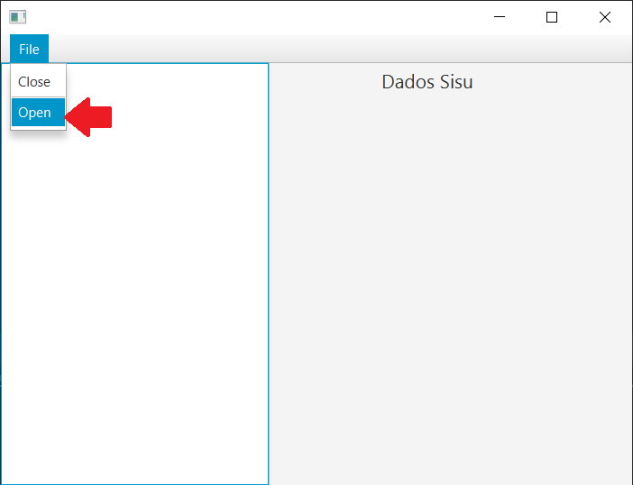

# Trabalho final de POO

Este é o projeto final da matéria de Programação Orientada a Objetos.
Ele foi construído utilizando a linguagem Java (https://docs.oracle.com/en/java/)
e o JavaFX (https://openjfx.io/) para criação da interface.

Este projeto cria um gráfico de pizza a partir da lista de aprovação do SISU,
ele mostra de quais estados são os alunos aprovados em um determinado curso.

## Requisitos

A lista de aprovados do sisu deverá ser informada em formato .txt e a mesma deve estar formatada de modo que os alunos de cada curso estejam juntos, sendo cada linha um candidato com número de matrícula, nome, curso, campus, demanda, nota e estado, respectivamente.

Os espaçamentos entre os dados de cada candidato também devem ser de 2 espaços ou mais.

## Como utilizar a aplicação

